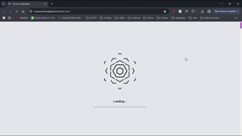

# **Sourav Sadukhan's Portfolio**

> "Where creativity meets innovation in a seamless digital journey"  
> *Crafted with passion & precision.*



---

## 🚀 Overview

Welcome to my **Portfolio Web Page**, a single page application designed to showcase my journey as a Frontend Developer. This project is a cutting-edge blend of futuristic aesthetics and sleek functionality, built to offer a unique, immersive experience.  
**Live Demo:** [souravfrank.github.io/about-me](https://souravfrank.github.io/about-me/)

---

## 💡 Features

- **Responsive Design:** Optimized for any device, anytime.
- **Smooth Animations:** Experience fluid transitions with Framer Motion & React Spring.
- **Dynamic Interactivity:** Engaging scroll effects with React Intersection Observer.
- **Modern UI/UX:** A minimalistic interface with a futuristic twist.
- **Seamless Communication:** Integrated with EmailJS for hassle-free contact.

---

## 🛠️ Tech Stack

- **Framework:** React
- **Build Tool:** Vite
- **Styling:** Tailwind CSS & modern CSS techniques
- **Animations:** Framer Motion, React Spring
- **Data Handling:** Axios for streamlined API communication
- **Icons:** Lucide React

---

## ⚙️ Installation & Setup

Clone the repository and run the following commands:

```bash
# Clone the repository
git clone https://github.com/souravfrank/about-me.git

# Navigate into the project directory
cd about-me

# Install dependencies
npm install

# Start the development server
npm run dev
```

---

## 📦 Deployment

This project is deployed on GitHub Pages. To deploy your changes:

```bash
npm run predeploy && npm run deploy
```

For a local preview before deployment:

```bash
npm run preview
```

---

## 🔮 Futuristic Inspirations

Embracing the spirit of innovation, this portfolio is not just a website—it's a digital manifesto. Blending code, creativity, and cosmic aesthetics, it paves the way for the future of modern web design.

---

## 🤝 Contributing

Contributions, feedback, and collaborative ideas are always welcome. Feel free to fork the repository and submit a pull request. Together, we can shape the future of digital experiences.

---


## 📫 Get in Touch

- **Email:** [ssadhukhan990@gmail.com](mailto:ssadhukhan990@gmail.com)
- **LinkedIn:** [Sourav Sadukhan](https://www.linkedin.com/in/souravsadhukhan)
- **GitHub:** [SouravFrank](https://github.com/SouravFrank)

---

> "The future is coded in creativity."  
> — *Sourav Sadukhan*